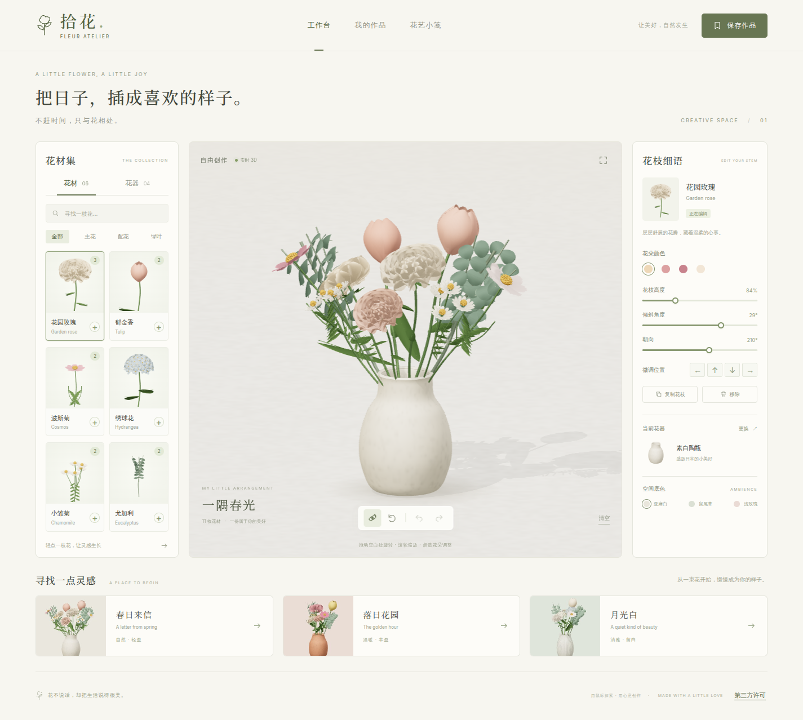
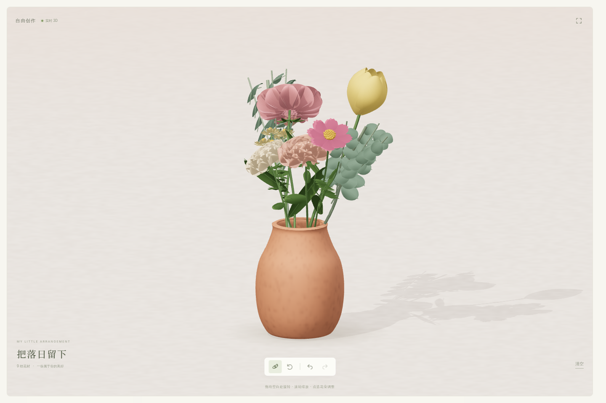
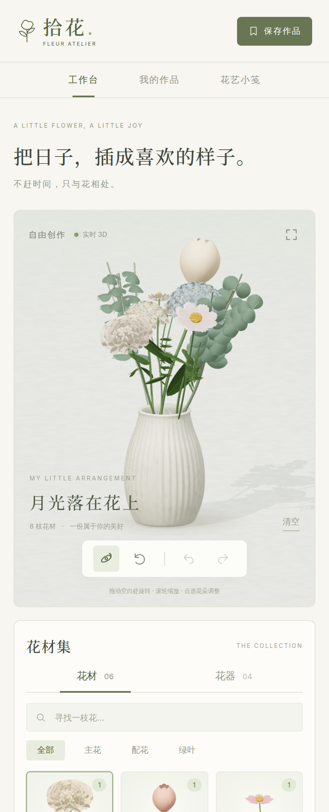

# 拾花 · Fleur Atelier

一间可以慢慢创作的网页版 3D 花艺工作室。使用 TypeScript、Three.js 与 Vite；花瓣、枝叶、花器和细微纹理均由程序生成，不依赖花材图片或外部 3D 模型。

## 在线地址

https://evegoodevening.github.io/flower-arranging/

## 运行

需要 Node.js 20.19+ 或 22.12+。

```sh
npm install
npm run dev
```

以终端输出的本地地址打开。指定端口：`npm run dev -- --port 5174 --strictPort`。

```sh
npm run build
npm run preview
```

生产文件生成到 `dist/`，可部署到普通静态网站托管服务。需要支持 WebGL 2 的现代浏览器；界面适配桌面和手机。Google Fonts 不可用时使用系统字体，不影响插花功能。

## 截图

### 桌面工作台



### 沉浸模式



### 手机端



## 玩法

- 点击或拖入花材卡片添加花枝：花园玫瑰、郁金香、波斯菊、绣球花、小雏菊、尤加利。
- 点击画布中的花枝选中，直接拖动花朵改变姿态；也可用右侧颜色、高度、倾斜、朝向和位置控件精细调整。
- 花器可切换为素白陶瓶、烟色玻璃、赤陶花器和褶影瓷瓶；提供三种空间底色。
- 拖动画布空白处旋转视角，滚轮或双指缩放；支持视角锁定、重置和沉浸模式。
- 支持复制、移除、清空、撤销和重做。快捷键：`Ctrl/Cmd + Z` 撤销、`Ctrl/Cmd + Shift + Z` 或 `Ctrl/Cmd + Y` 重做、`Delete` 移除选中的花枝、`Esc` 退出沉浸模式。
- 三束灵感作品可作为起点；更换灵感和清空花束均可撤销。
- 草稿自动保存在当前浏览器。点击「保存作品」收藏花束，或下载 1800 × 1800 PNG；收藏中的图片为 600 × 600 JPEG，重新打开作品可导出高清图。

每束最多 36 枝花材，收藏夹最多 12 件作品，撤销历史最多 60 步。数据仅保存在当前浏览器的 localStorage，不上传服务器、不跨设备同步；清除浏览器数据会移除草稿和收藏。存储不可用时仍可插花和下载图片。

## 实现位置

- `src/catalog.ts`：花材、花器、颜色与三束灵感作品。
- `src/botanicals.ts`：确定性花瓣曲面、枝叶与空心花器建模、材质及资源释放。
- `src/studio.ts`：工作室光照、按需渲染、轨道相机、射线拾取、花枝拖动及一致色彩的图片输出。
- `src/main.ts`：插花状态、操作历史、目录筛选、作品收藏与界面交互。
- `src/style.css` / `index.html`：响应式中文工作台。

同一 WebGL 渲染器负责工作台、目录缩略图和作品导出；花材按材质合并几何体，静止时不持续渲染。

## 第三方声明

点击页面底部的「第三方许可」可打开完整声明弹窗，滚动阅读或通过「查看原文」打开文本文件。支持关闭按钮、Esc 或点击弹窗外部关闭；桌面与手机端均可使用，且不依赖 3D 工作台成功初始化。

版权与完整许可证见 [THIRD_PARTY_NOTICES.txt](public/THIRD_PARTY_NOTICES.txt)，包含 Three.js、Vite 随构建输出的运行时辅助代码，以及通过 Google Fonts 加载的 Inter 和 Noto Serif SC 字体；另列出仅用于开发的直接依赖。

`npm run build` 会将声明原样复制到 `dist/THIRD_PARTY_NOTICES.txt`，部署或再分发时请一并保留。字体文件由 Google Fonts 托管，不包含在 `dist/` 中。升级依赖或更换字体时，请根据锁文件和上游许可证同步更新声明。
